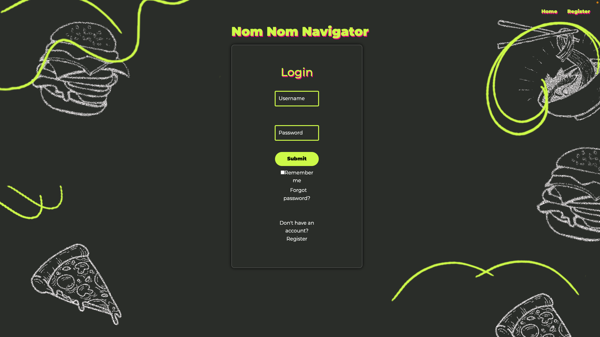

# NOM NOM Navigator Restaurant Locator Application

## Overview

<!--  -->

The Restaurant Locator is a web-based application designed to help users find the top three restaurant suggestions within their vicinity. Leveraging the Google Maps API, it provides an intuitive interface for locating restaurants and cafes, complete with a map and detailed information about each establishment.

## Objective

To provide a user-friendly and efficient method for individuals to discover restaurants and cafes near their location. The application aims to simplify the process of finding dining options, making it convenient and accessible for all users.

## Table of Contents

- [Installation](#installation)
- [Usage](#usage)
- [Features](#features)
- [Built With](#built-with)
- [Contributing](#contributing)
- [License](#license)

## Installation

1. Clone the GitHub repository.
2. Navigate to the application directory in your terminal.
3. Ensure Node.js and npm are installed.
4. Run `npm install` to install all dependencies.
5. Set up environment variables in a `.env` file including `SESSION_SECRET` and `GOOGLE_API_KEY`.
6. Create and configure the MySQL database using the provided schema.
7. Populate the database with initial data using the `seeds.js` script.
8. Start the server using `npm start`.
9. Access the application at `http://localhost:3001` in your web browser.

## Usage

Enter a location in the search bar on the application's homepage. The app will display the top three restaurants or cafes in the vicinity on the interactive map. Detailed information about each restaurant can be viewed by clicking on their respective card in the carousel.

    

### Special Usage Note:

    Ensure your Google Maps API key is valid and has the necessary permissions for the application to function correctly.

## Features

- **Interactive Map:** Displays the location of suggested restaurants.
- **Top 3 Restaurant Suggestions:** Shows the best dining options based on user location.
- **Responsive Design:** Optimized for various devices, providing a seamless user experience.
- **User-friendly Interface:** Easy navigation and clear layout.

## Built With

- [Node.js](https://nodejs.org/en/)
- [Express.js](https://expressjs.com/)
- [Handlebars.js](https://handlebarsjs.com/)
- [Sequelize](https://sequelize.org/)
- [Google Maps JavaScript API](https://developers.google.com/maps/documentation/javascript/overview)
- [Bootstrap](https://getbootstrap.com/)

## Contributors

- Andrew Tullos - [GitHub](https://github.com/AndrewTullos)
- Catherine Parker - [GitHub](https://github.com/caparker23)

## Contributing

Contributions to improve the project are welcome. Please follow these steps:

1. Fork the project
2. Create your feature branch (`git checkout -b feature/AmazingFeature`)
3. Commit your changes (`git commit -m 'Add some AmazingFeature'`)
4. Push to the branch (`git push origin feature/AmazingFeature`)
5. Open a pull request

## License

This project is licensed under the ISC License.
